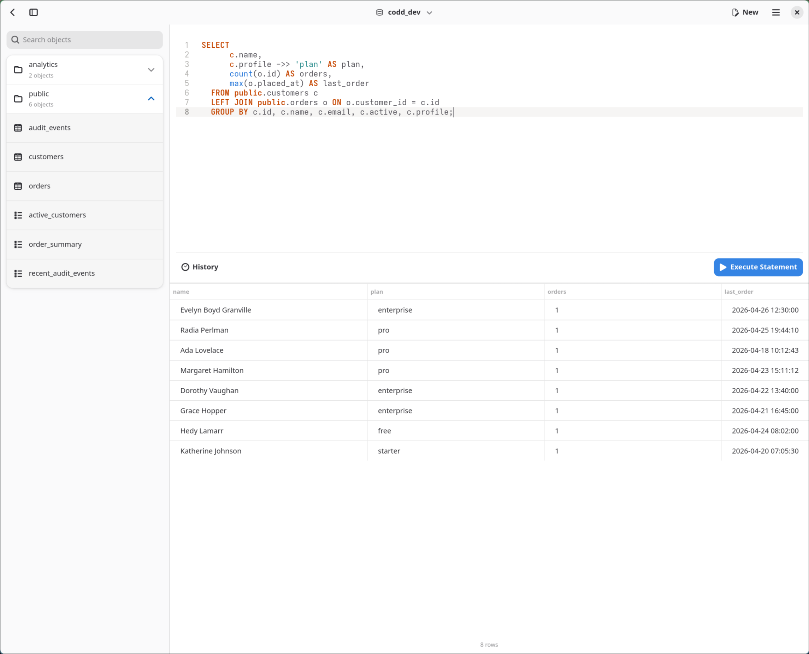

# Codd

Codd is a lightweight native PostgreSQL client for GNOME, built with Rust, Relm4, GTK4, libadwaita, GtkSourceView and sqlx. It is named after Edgar F. Codd, the computer scientist who introduced the relational model for database management.



[](https://flathub.org/apps/io.github.anil_e.Codd)

The app started as a personal-use SQL editor: lightweight, native, focused, and built around clean PostgreSQL query workflows without Electron. It can save multiple PostgreSQL connections, but it is not trying to be a multi-engine database suite. It is still early and many extensions are planned, including richer result handling, editor actions, and more production-quality database tooling.

## Features

- Save and reopen PostgreSQL connections
- Store connection passwords securely in Keyring
- Browse tables and views
- Inspect table structure, including columns, indexes, constraints, foreign keys, and triggers
- Write SQL with syntax highlighting and line numbers
- Reuse automatically saved query history per database
- Browse table rows with pagination, filters, custom SQL filters, and editable cell values
- Generate common table scripts from the object sidebar
- Rename, truncate, and delete tables or views from the object sidebar

## Requirements

Fedora:

```bash
sudo dnf install \
  rust cargo meson ninja-build pkgconf-pkg-config \
  gtk4-devel libadwaita-devel gtksourceview5-devel \
  glib2-devel glib2-devel-tools \
  desktop-file-utils appstream gettext
```

Arch:

```bash
sudo pacman -S \
  rust cargo meson ninja pkgconf \
  gtk4 libadwaita gtksourceview5 \
  glib2 desktop-file-utils appstream gettext
```

## Run

```bash
cargo run
```

## Build & Install

```bash
meson setup _build
meson compile -C _build
sudo meson install -C _build
```

After installation, launch Codd from your app menu or run `codd`.

## Demo Database

A small PostgreSQL demo database is available in `dev/demo_database.sql`.

```bash
psql -f dev/demo_database.sql
```
